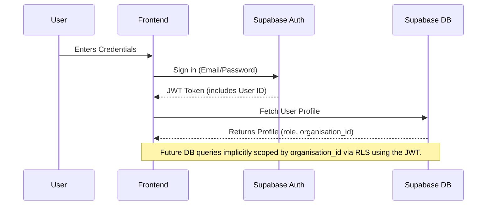
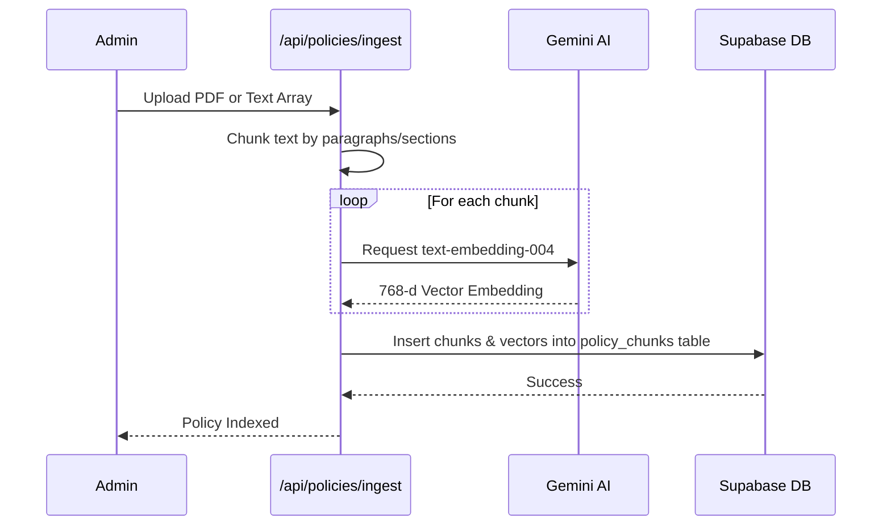
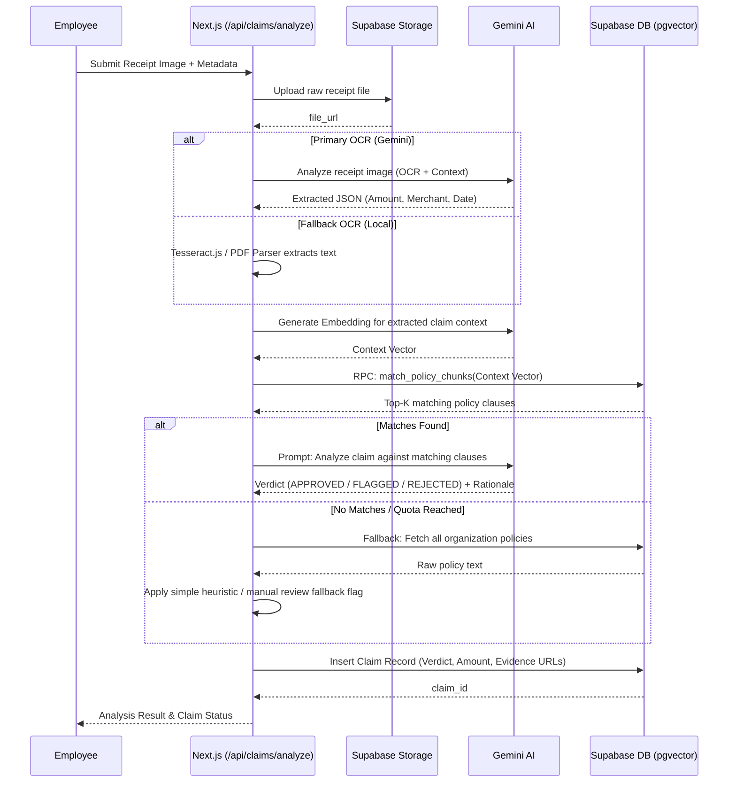

# PolicyLens Architecture

This document provides a deep dive into the technical architecture, data flows, and structural design of PolicyLens.

## High-Level System Architecture

PolicyLens is built on a modern serverless stack, leveraging edge-ready API routes and managed database services.

```mermaid
graph TD
    Client[Web Client (React / Next.js)]
    NextJS[Next.js App Router]
    SupabaseDB[(Supabase PostgreSQL)]
    SupabaseAuth[Supabase Auth]
    SupabaseStorage[Supabase Storage]
    Gemini[Google Gemini 2.0 Flash API]
    Tesseract[Tesseract.js (Local Fallback)]
    Resend[Resend Email API]

    Client <-->|HTTPS / Server Actions| NextJS
    NextJS <-->|REST / SDK| SupabaseAuth
    NextJS <-->|pg/pgvector| SupabaseDB
    NextJS <-->|Upload/Download| SupabaseStorage
    NextJS <-->|Prompt / Embeddings| Gemini
    NextJS <-->|Local OCR| Tesseract
    NextJS -->|SMTP/API| Resend
```

## Core Components

1. **Frontend (Next.js Application)**: Built using React 18+ components (Server & Client), TailwindCSS, and Shadcn UI.
2. **Authentication**: Handled by Supabase Auth with Row Level Security (RLS). Users are grouped by their `organisation_id` to ensure strict horizontal multi-tenancy.
3. **Database (Supabase PostgreSQL)**: Stores structured data (users, claims, policies). Uses `pgvector` for storing 768-dimensional embeddings of policy text.
4. **AI Engine (Gemini & Fallbacks)**: Gemini handles semantic extraction from receipts and assesses policy compliance. Tesseract acts as a deterministic local OCR fallback.

## Key Data Flows

### 1. Multi-Tenant Authentication Flow


### 2. Policy Ingestion & Vectorization Flow
When an administrator uploads a new PDF policy, it must be vectorized so the AI can retrieve relevant clauses when analyzing claims.



### 3. Claim Submission & AI Analysis Flow (The Core Pipeline)
This is the most complex flow, utilizing primary AI extraction and multiple layers of fallbacks to guarantee a result even if vendor quotas are breached.



## Security & Multi-Tenancy (RLS)
The database enforces tenant isolation unconditionally. Every table containing sensitive data (`claims`, `policies`, `profiles`) has a Row Level Security policy like:

```sql
CREATE POLICY "Users view own org data" ON claims
  FOR SELECT USING (organisation_id = auth.jwt()->>'org_id');
```
This guarantees that even if a bug in the API attempts to query all claims, the database will only return claims belonging to the authorized user's organization.

## AI Fallback Architecture (Resilience)
The `src/lib/gemini.ts` wrapper implements circuit breakers.
1. **Exponential Backoff**: API rate limits directly trigger 3 retry attempts with exponential delays.
2. **Graceful Degradation**: If Gemini quota is entirely exhausted, the system seamlessly redirects file processing to the local `Tesseract.js` worker, ensuring extraction still functions deterministically.

## Background Jobs (Cron)
- `/api/cron/digest`: A Vercel Cron triggered endpoint that aggregates pending/flagged claims and emails managers/admins a daily review digest using the Resend API.
