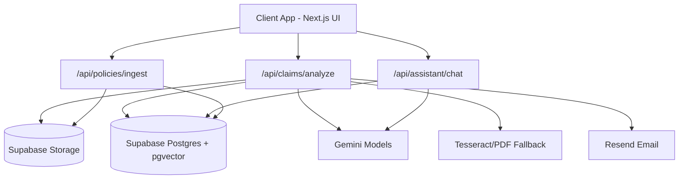

# PolicyLens: AI-Driven Expense Compliance Platform

Automated policy-first expense auditing for finance teams.
Upload a receipt, add business context, and receive a policy-grounded AI verdict with explainable reasoning and review routing.

---

## Table of Contents

- [Overview](#overview)
- [Key Features and Benefits](#key-features-and-benefits)
- [System Architecture](#system-architecture)
- [Complete Workflow](#complete-workflow)
- [Project Structure](#project-structure)
- [Getting Started](#getting-started)
- [Environment Variables](#environment-variables)
- [API Reference](#api-reference)
- [Analyze Response Shape](#analyze-response-shape)
- [Policy Documents and Ingestion](#policy-documents-and-ingestion)
- [Tech Stack](#tech-stack)

---

## Overview

PolicyLens moves expense compliance from a reactive, post-submission audit process to a submission-time guidance model.

| Aspect | Detail |
|---|---|
| Core Problem | Manual claim review creates delays, inconsistent checks, and policy leakage |
| Primary Users | Employees (submit claims), Admins/Finance (review and export) |
| AI Pipeline | Receipt OCR + policy retrieval (pgvector) + verdict reasoning |
| Tenancy Model | Multi-tenant, organisation-scoped data with Supabase RLS |
| Throughput Guardrails | Per-user hourly rate limits for analyze and assistant endpoints |
| Reliability Strategy | Multi-stage extraction fallbacks + deterministic verdict fallback |

---

## Key Features and Benefits

### 1. Receipt Ingestion with OCR and Validation
Accepts JPG/PNG/WebP/PDF receipts with server-side magic-byte validation.
Benefit: reduces malformed file ingestion and improves extraction reliability.

### 2. Pre-Submission Image Quality Checks
Client-side Canvas checks detect blur, darkness, and overexposure before upload.
Benefit: catches unreadable receipts early and avoids wasted AI calls.

### 3. Multi-Stage Extraction Fallbacks
Pipeline uses Gemini OCR, PDF text extraction, Gemini best-effort, and local OCR heuristics.
Benefit: high availability even during model/API instability.

### 4. Policy-Aware Verdicting (RAG)
Embeds query context and retrieves active policy chunks from pgvector before verdict generation.
Benefit: verdicts are grounded in policy context instead of generic LLM output.

### 5. Explainability in UI
Displays verdict reason, policy reference, and per-field extraction confidence metadata.
Benefit: faster human review and better trust in automated decisions.

### 6. Batch and Offline Submission Support
Includes batch queue workflow and offline queue flush behavior via service worker messaging.
Benefit: practical mobile/field use under unstable connectivity.

### 7. Review Ops and Feedback Loop
Admins can override verdicts; overrides are recorded into feedback data for future improvement.
Benefit: controlled human-in-the-loop governance.

### 8. Finance Export Integration
Approved claims can be exported in QuickBooks IIF, Xero CSV, and BACS-style CSV.
Benefit: reduced manual accounting handoff effort.

---

## System Architecture



Key architectural points:
- Next.js App Router powers both frontend pages and API routes.
- Supabase is used for auth, RLS-protected data, object storage, and vector search.
- Gemini handles OCR, embeddings, and reasoning; local fallbacks preserve continuity.
- Service worker registration and background queue flush support offline claims flow.

---

## Complete Workflow

1. Employee uploads receipt and enters business purpose.
2. Client runs image quality checks and allows optional manual overrides.
3. API validates auth, organisation context, file type/size, and rate limit.
4. Receipt uploads to storage and extraction pipeline begins.
5. System resolves active policies and retrieves relevant chunks via pgvector search.
6. Verdict is generated with AI; deterministic fallback is used if generation fails.
7. Claim is stored with confidence/review metadata and duplicate warning signals.
8. Notifications are sent to employee/admin based on claim state.
9. Admin can review, override, and export approved claims.

---

## Project Structure

```text
expense auditor/
├── src/
│   ├── app/
│   │   ├── admin/                 # Admin UI: claims, policies, exports, mappings
│   │   ├── employee/              # Employee UI: submit, claims, assistant, dashboard
│   │   ├── auth/                  # Login/register pages
│   │   ├── onboarding/            # Create/join organisation flow
│   │   └── api/                   # API routes (claims, policies, assistant, exports, cron)
│   ├── lib/
│   │   ├── gemini.ts              # OCR, embeddings, verdict generation, fallbacks
│   │   ├── supabase-server.ts     # Server and admin Supabase clients
│   │   └── email.ts               # Email sender + templates
│   ├── providers/
│   │   └── RealtimeProvider.tsx   # Realtime claim notifications + SW registration
│   └── middleware.ts              # Auth, role routing, onboarding guards
├── public/
│   └── sw.js                      # Service worker and offline queue flush trigger
├── scripts/
│   ├── seed_demo_data.js
│   └── seed_users.ts
├── supabase_setup.sql
├── ARCHITECTURE.md
└── APPROACH_DOCUMENT.md
```

---

## Getting Started

### Prerequisites

| Requirement | Notes |
|---|---|
| Node.js | 20+ recommended |
| npm | Comes with Node.js |
| Supabase project | Required for auth, DB, and storage |
| Gemini API key | Required for AI pipeline |
| Resend API key | Optional; without it, emails are logged as mock output |

### 1. Install dependencies

```bash
npm install
```

### 2. Configure environment

Create .env.local in the project root:

```env
NEXT_PUBLIC_SUPABASE_URL=your_supabase_url
NEXT_PUBLIC_SUPABASE_ANON_KEY=your_supabase_anon_key
SUPABASE_SERVICE_ROLE_KEY=your_service_role_key
GEMINI_API_KEY=your_gemini_api_key

# Optional
RESEND_API_KEY=your_resend_api_key
SENDER_EMAIL=onboarding@resend.dev
CRON_SECRET=your_cron_secret
ENABLE_TESSERACT_OCR=true
```

### 3. Initialize database schema

Run [supabase_setup.sql](supabase_setup.sql) in Supabase SQL Editor.

This creates:
- Multi-tenant tables and relationships
- pgvector support and HNSW index for policy retrieval
- match_policy_chunks RPC
- RLS policies and auth profile trigger

### 4. Configure storage buckets

Create these buckets in Supabase Storage:
- receipts (receipt uploads)
- policy-docs (policy PDF uploads)

### 5. Optional demo seed

```bash
npm run seed:demo
```

### 6. Run app

```bash
npm run dev
```

Open http://localhost:3000

---

## Environment Variables

| Variable | Required | Purpose |
|---|---|---|
| NEXT_PUBLIC_SUPABASE_URL | Yes | Supabase project URL |
| NEXT_PUBLIC_SUPABASE_ANON_KEY | Yes | Browser-safe Supabase key |
| SUPABASE_SERVICE_ROLE_KEY | Yes | Server-side privileged operations |
| GEMINI_API_KEY | Yes | Gemini OCR/embedding/reasoning |
| RESEND_API_KEY | No | Transactional emails; if missing, email calls are mocked |
| SENDER_EMAIL | No | Sender address for email notifications |
| CRON_SECRET | No | Auth guard for weekly digest endpoint |
| ENABLE_TESSERACT_OCR | No | Set false to disable local OCR fallback |

---

## API Reference

Authentication for these endpoints relies on Supabase session cookies.

### Claims

| Method | Endpoint | Description |
|---|---|---|
| POST | /api/claims/analyze | Main receipt analysis pipeline and verdict generation |
| GET | /api/claims | List claims (role-scoped); supports status filter and CSV export query |
| PATCH | /api/claims/[id] | Admin review override to approved/rejected with note |
| DELETE | /api/claims/[id] | Delete claim (owner or admin) |
| POST | /api/claims/bulk | Dry-run AI verdict generation for multiple rows |
| GET | /api/claims/export | Export approved claims as quickbooks/xero/bacs formats |

### Policies

| Method | Endpoint | Description |
|---|---|---|
| POST | /api/policies/ingest | Upload and embed policy PDF chunks |
| PATCH | /api/policies/[id]/activate | Activate policy document for org |
| GET | /api/policies/[id] | Generate signed view URL for policy PDF |
| DELETE | /api/policies/[id] | Delete policy document and storage file |
| POST | /api/policies/clause | Generate clause draft from policy gap recommendation |

### Assistant and Admin Ops

| Method | Endpoint | Description |
|---|---|---|
| POST | /api/assistant/chat | Policy Q and A using org-scoped RAG context |
| GET | /api/admin/gl-mappings | List GL mappings for current admin org |
| POST | /api/admin/gl-mappings | Upsert GL mapping for category |
| GET | /api/employee/budget | Category budget and current month spend snapshot |
| GET | /api/cron/digest | Weekly org digest emails (optionally protected by CRON_SECRET) |

### Auth and Onboarding

| Method | Endpoint | Description |
|---|---|---|
| POST | /api/auth/register | Create user with profile metadata and auto-login attempt |
| POST | /api/onboarding | Join org, create org, or complete admin onboarding |

---

## Analyze Response Shape

Typical response from POST /api/claims/analyze:

```json
{
  "success": true,
  "claim": {
    "id": "uuid",
    "status": "approved|flagged|rejected",
    "requires_review": true,
    "is_duplicate_warning": false
  },
  "extracted": {
    "merchant": "string",
    "amount": 123.45,
    "currency": "INR",
    "date": "YYYY-MM-DD",
    "category": "meals",
    "confidence": "high|medium|low",
    "field_confidence": { "merchant": 90, "amount": 92, "date": 84 },
    "field_source": { "merchant": "ocr", "amount": "manual", "date": "ocr" }
  },
  "verdict": {
    "verdict": "approved|flagged|rejected",
    "reason": "string",
    "policy_reference": "string"
  },
  "compared_policies": ["Travel Policy 2026"],
  "policy_chunks_used": 8
}
```

Unreadable path returns:

```json
{
  "success": false,
  "unreadable": true,
  "message": "The receipt image is unclear or unreadable. Please upload a clearer photo."
}
```

---

## Policy Documents and Ingestion

Policy ingestion expects PDF files and performs:
1. Server-side PDF signature validation.
2. PDF text extraction.
3. Chunking into overlap-aware segments.
4. Batch embedding to 768-d vectors.
5. Storage into policy_chunks for org-scoped retrieval.

Policy document lifecycle is admin-driven:
- ingest policy
- activate selected policy
- view via signed URL
- delete when deprecated

---

## Tech Stack

| Layer | Technology | Purpose |
|---|---|---|
| Framework | Next.js 16 + React 19 | Full-stack app and route handlers |
| Styling | Tailwind CSS 4 | UI styling |
| Database | Supabase PostgreSQL | Claims, policies, profiles, logs |
| Vector Search | pgvector + HNSW | Semantic policy chunk retrieval |
| Storage | Supabase Storage | Receipts and policy PDFs |
| AI | Google Gemini APIs | OCR, embeddings, verdict generation, chat |
| OCR Fallback | tesseract.js + pdf-parse | Local extraction fallback paths |
| Email | Resend | Transactional notifications |
| PWA | next-pwa + service worker | Offline support and sync triggers |

---

For deeper internals, see [ARCHITECTURE.md](ARCHITECTURE.md) and [APPROACH_DOCUMENT.md](APPROACH_DOCUMENT.md).
